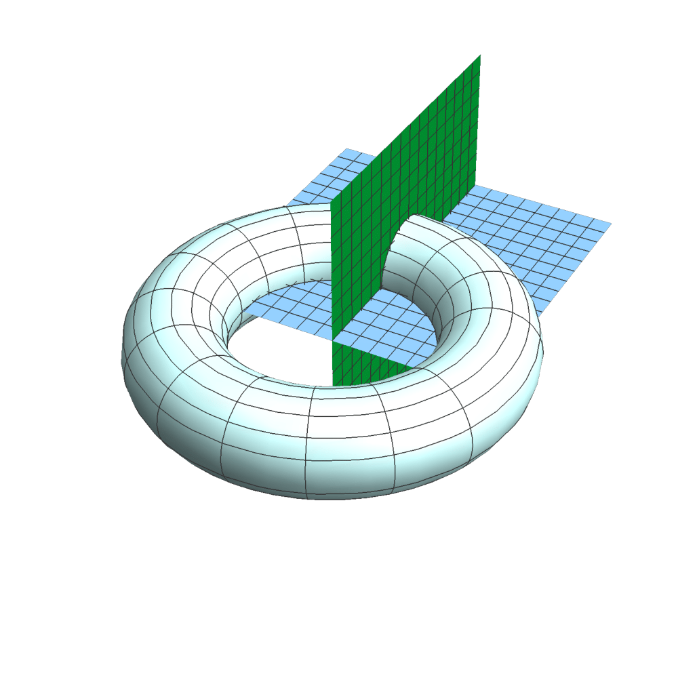

# Differential_geo_hons
Honors project in differential geometry, with a focus on the First and Second fundamental form, and their relation to the intrinsic and extrinsic features of the general surface of revolution.

[Project pdf.](Honors/Thesis-Hon.pdf)

Folder contains the complete LaTeX files and the project pdf. 
All images included are my own unless otherwise stated within the work.

